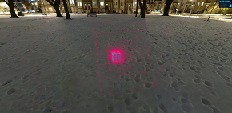

## TEindex

### Documentation

- Generated with [Angular CLI](https://github.com/angular/angular-cli) version 1.3.0.

- Some cases of using [Three.js](https://github.com/mrdoob/three.js).

- Mainly based on Typescript.

- Personal entertainment project.

### Installation

    npm install
    npm start || ng server

### Page

<figure class="half">
    
    
</figure>
<figure class="third">
    
    
    
</figure>
<figure class="third">
    
    
    
</figure>

### License
MIT